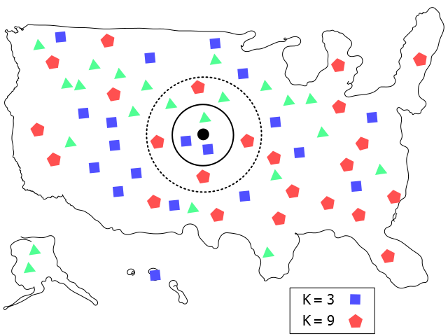
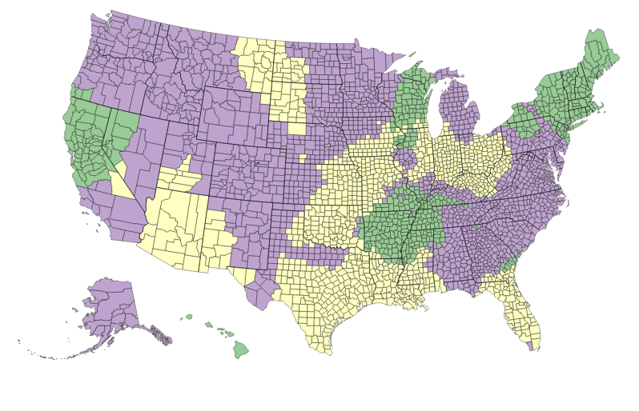
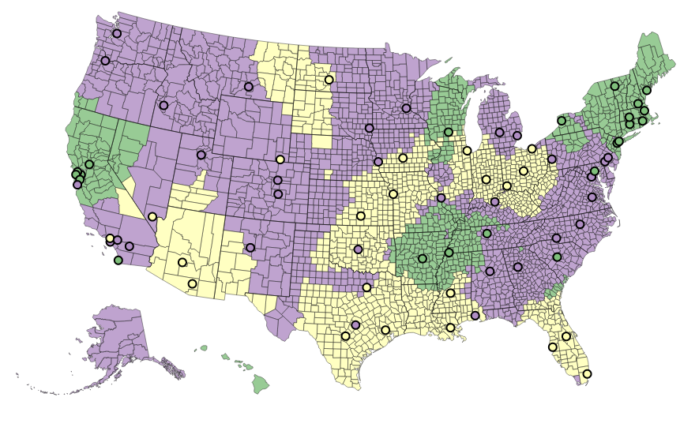

Recently, I've been doing some reading on data science and visualization. Some resources that have been helpful so far:

* [Data Science from Scratch by Joel Grus](http://shop.oreilly.com/product/0636920033400.do)

* [Interactive Data Visualization for the Web by Scott Murray](http://chimera.labs.oreilly.com/books/1230000000345)

* [Machine Learning A Probabilistic Perspective by Kevin Murphy](http://www.amazon.com/Machine-Learning-Probabilistic-Perspective-Computation/dp/0262018020)

* [D3 on AngularJS Create Dynamic Visualizations with AngularJS](https://leanpub.com/d3angularjs)

After all the reading, I felt an urge to put some of the stuff I've learned to practice. In this tutorial we're going to make a k-nearest neighbors (knn) based music preference map with d3.js and Python (like the one shown at the top of the page!). Note, this is more of an exercise to practice going from raw data to the visualization rather than an in-depth exploration of machine learning or data visualization concepts.

Some things you're going to need:

* Python +  packages - IPython (it makes life easier), pandas, numpy, requests. I'm assuming that you're already familiar with Python and its packages.

* d3.js 

* Some HTML and CSS knowledge is also helpful.

# The Data Set 

The data set we're going to be working with is contained in a file named <strong>city-data.txt</strong>, which is taken directly from Joel Grus's book on datascience. The data set is originally from an imaginary survey by an imaginary company called DataScienster, where they collected the preferred programming languages of their users across all major cities in the US. The list contains the coordinates for the cities and its preferred programming language. For this tutorial, we're going to tweak things a little bit and change the preferred programming languages to musical genres, since this is a music oriented website. 

Now, our task is to estimate the musical preferences of ALL counties in the US based on the sampled data. This is where our knn algorithm comes in. Finally, we're going to display our results in an interactive map using d3.js. The counties are going to be highlighted according to their preference in musical genre. Counties that prefer Rock is going to be purple, Reggae is green, and House is yellow. We're also going to plot the sampled data points on the map so you get a visual representation of how well the knn algorithm performed.

# Data Munging 

Before we can analyze the data, we have to clean the data since it's a little messy; we have to munge the data. Data munging (wrangling) is a task where we take our "raw" data set and convert it to a format that is more amenable to data analysis. We first go to the directory in which the <strong>city-data.txt</strong> file is contained and then start our Ipython environment. Our text file is read into the notebook using the <strong>with open</strong> command. The <strong>with open</strong> idiom ensures that the file closes once the file is read, regardless of if an exception occurs or not. We then remove some regular expression characters such as \n (new line), parantheses, single quotes, and split the data at the commas. 

 

In [1]:
import re
import string
import pandas as pd
import json
import numpy as np

with open('city-data.txt', 'r') as f:
    cities = [re.sub('[()\n]', '', cities) for cities in f.readlines()]
    cities = [cities.replace("'",'') for cities in cities]
    cities = [cities.split(',') for cities in cities]
cities[:5]

Out[1]:
[['-86.75', '33.5666666666667', 'Python', ''],
 ['-88.25', '30.6833333333333', 'Python', ''],
 ['-112.016666666667', '33.4333333333333', 'Java', ''],
 ['-110.933333333333', '32.1166666666667', 'Java', ''],
 ['-92.2333333333333', '34.7333333333333', 'R', '']]

 

The result is a list of strings with the first two elements of each list being the longitude and the latitude and the third being a programming language of preference. We want to clean the data further and create a pandas data frame for intuitive data manipulation. Let's convert the string data into floats so that we can actually manipulate them as floating point numbers; we use list comprehension for this task.  We then create a pandas dataframe with three columns. The <strong>.head()</strong> function reveals the first five elements of the dataframe. Notice that I've used "Genre" instead of "preferred language." This is done in anticipation of the following step.



In [2]:
longitude, latitude, Genre  = zip(*cities)
longitude = [float(longitude) for longitude in longitude]
latitude = [float(latitude) for latitude in latitude]
city_data = zip(longitude, latitude, Genre)
df = pd.DataFrame(data=city_data, columns=['Longitude', 'Latitude', 'Genre'])
df.head()

Out[2]:
	 Longitude	Latitude	Genre
0	-86.750000	33.566667	Python
1	-88.250000	30.683333	Python
2	-112.016667	33.433333	Java
3	-110.933333	32.116667	Java
4	-92.233333	34.733333	R

 

As mentioned before, this is suppose to be a music oriented website so we're going to change the preferred programming languages to musical genres. As mentioned earlier, we've already cheated a bit and called the column "Genres" when we instantiated the dataframe object. Three genres of music are chosen randomly to replace the programming languages.



In[3]:
df.ix[df.Genre == 'Python', 'Genre'] = 'Rock'
df.ix[df.Genre == 'Java', 'Genre'] = 'House'
df.ix[df.Genre == 'R', 'Genre'] = 'Reggae'
df.head()

Out[3]:
	 Longitude	Latitude	Genre
0	-86.750000	33.566667	Rock
1	-88.250000	30.683333	Rock
2	-112.016667	33.433333	House
3	-110.933333	32.116667	House
4	-92.233333	34.733333	Reggae

 

We want to to save this data as a json file so that we can use d3 to plot the original coordinates on a map of the US. I do this in a somewhat hacky way, but it works. It also makes the json file look nicer. 



In [4]:
city_data = df.to_json(orient='records')
city_data = json.loads(city_data)
pretty_city = json.dumps(city_data, indent=4, sort_keys=True)
text_files = open("city_data.json", "w")
text_files.write(pretty_city)
text_files.close()

 

Our JSON file:



[
    {
        "Genre": "Rock", 
        "Latitude": 33.5666666667, 
        "Longitude": -86.75
    }, 
    {
        "Genre": "Rock", 
        "Latitude": 30.6833333333, 
        "Longitude": -88.25
    }, 
    {
        "Genre": "House", 
        "Latitude": 33.4333333333, 
        "Longitude": -112.0166666667
    },
...
]

 

# knn 

The next step is to perform the classification based on a knn algorithm. I basically used Joel Grus's algorithm since I was too lazy to write my own. The code is unabashedly pasted below.  



In [5]:
import math
from collections import Counter

def dot(v, w):
    """v_1 * w_1 + ... + v_n * w_n"""
    return sum(v_i * w_i for v_i, w_i in zip(v, w))

def sum_of_squares(v):
    """v_1 * v_1 + ... + v_n * v_n"""
    return dot(v, v)

def squared_distance(v, w):
    return sum_of_squares(vector_subtract(v, w))

def distance(v, w):
    return math.sqrt(squared_distance(v, w))

def vector_subtract(v, w):
    """subtracts two vectors componentwise"""
    return [v_i - w_i for v_i, w_i in zip(v,w)]

def vector_sum(vectors):
    return reduce(vector_add, vectors)

def majority_vote(labels):
    vote_counts = Counter(labels)
    winner, winner_count = vote_counts.most_common(1)[0]
    num_winners = len([count for count in vote_counts.values() 
                       if count == winner_count])
    if num_winners == 1:
        return winner
    else: 
        return majority_vote(labels[:-1])

def knn_classify(k, labeled_points, new_point):
    """each labeled point should be a pair (point, label)"""
    
    # order the labeled points from nearest to farthest
    by_distance = sorted(labeled_points, key=lambda (point, _): distance(point, new_point))

    # find the labels for the k closest
    k_nearest_labels = [label for _, label in by_distance[:k]]

    # and let them vote
    return majority_vote(k_nearest_labels)

 

If you're new to machine learning this might be kind of intimidating, but rest assured this is not very complicated. In fact, knn is one of the simplest algorithms there is in machine learning. To explain how it works, I've illustrated the classification strategy in the figure below. Assume that we have sampled data from random locations in the US to see whether people prefer rock (red pentagons), house (blue squares), or reggae (green triangles). Now we'd like to guess what musical genre people prefer at the location indicated by the black circle. The preference is classified by determining the number of most frequently occurring labels from our sampled data nearest to the black circle. In the case where k=3 points (solid circle), we get house (blue squares) since there's two blue squares versus one green triangle and zero red pentagons. If we increase k to k=9 (dashed circle), it changes to rock (red pentagon). One subtlety is the distance metric one uses for the algorithm. Here, we've used a simple Euclidean metric, which is basically the straight line distance from point A to point B. However, it's good know there are other types, such as Cosine, Hamming, and Manhattan.

To estimate the musical genre preference of each county, we need the coordinates of all the counties in the United States. Luckily I found a list of the latitudes and longitudes for all the counties in the US without needing to scrape the web. The data is saved in a .csv file called <strong>counties_coord.csv</strong>. We read the csv file into pandas using the <strong>.read_csv()</strong> function. Because the coordinates were in a funky format, we apply a multiplication factor to the longitude and latitude columns.  


In [6]:
counties = pd.read_csv('counties_coord.csv', names=['County', 'State', 'latitude', 'longitude'] )
add_decimal = lambda x: np.round(x * 0.000001, 1)
counties['longitude'] = counties['longitude'].apply(add_decimal)
counties['latitude'] = counties['latitude'].apply(add_decimal)
counties.head()

Out[6]:
    County          State  latitude  longitude
0   Aleutians East  AK     55.2      -161.9
1   Aleutians West  AK     52.2      -175.1
2   Anchorage       AK     61.2      -149.2
3   Bethel          AK     60.9      -160.1
4   Bristol Bay     AK     58.7      -157.0

 

# Getting FIPS codes using requests

When applying styles such as coloring to create choropleth maps, d3 requires distinct path elements for each feature, such as counties, states, and countries. For counties in the US we can use standard FIPS codes, which we need to somehow obtain. Mike Bostock has posted a list of county names and the respective FIPS numbers in a .tsv file [here](https://gist.github.com/mbostock/4090846#file-us-state-names-tsv). 

I actually took a different route and simply quiered the fcc database for the FIPS codes associated with each coordinate by passing in the longitude and latitude for each county. This way we get an automatically sorted list of all the FIPS codes for each county in the same order as the counties in our dataframe. 



In [7]:

import requests
import time
url_string = 'http://data.fcc.gov/api/block/2010/find?format=json'
FIPS = []
pred_coord = counties[['longitude','latitude']]
pred_coord = pred_coord.to_dict(orient='records')
for coord in pred_coord:
    r = requests.get(url_string, params=coord)
    print(r.text)
    try:
        FIPS.append(int(r.json()['County']['FIPS']))
    except:
        FIPS.append(int(0))
    print(coord)
    print(FIPS)
    time.sleep(1)

 

We then create a dataframe using the FIPS code and concatenate it with our existing dataframe.



In [8]:
FIPS = pd.DataFrame(data=FIPS, columns=['FIPS'])
FIPS.head()

Out [8]:
    FIPS
0   2013
1   2016
2   2020
3   2050
4   2060

 



In [9]:
counties_data = pd.concat([counties, FIPS], axis=1)
counties_data.tail()

Out [9]:
        County      State  latitude  longitude  FIPS
3136    Sweetwater  WY     41.7      -108.9     56037
3137    Teton       WY     43.9      -110.6     56039
3138    Uinta       WY     41.3      -110.5     56041
3139    Washakie    WY     43.9      -107.7     56043
3140    Weston      WY     43.8      -104.6     56045

 

# Putting it all together

The final step in our analysis is to apply the knn algorithm to our data to predict the musical preference of each county based on our existing data. For this analysis, we choose k=3. If you're curious, try using different k's and see what happens. The output is saved in a new column called 'Genre.'



In [10]:
k = 3
counties_data['Genre'] = map(lambda longitude, 
                              latitude: knn_classify(k, cities, [longitude, latitude]),
                              counties_data['longitude'],
                              counties_data['latitude'])

 

We can use the <strong>.unique()</strong> function to show all the unique labels in the Genre column as a sanity check. We should see all three genres.



In [11]:
counties_data['Genre'].unique()

Out[11]:
array(['Rock', 'House', 'Reggae'], dtype=object)

 

Finally, we save the <strong>counties_data</strong> dataframe into a .csv so that we could use it later when we draw our map in d3.js. We're done with our data analysis.



In [12]:
counties_data.tail()

Out[12]:
        County      State  latitude  longitude FIPS   Genre
3136    Sweetwater  WY     41.7      -108.9    56037  Rock
3137    Teton       WY     43.9      -110.6    56039  Rock
3138    Uinta       WY     41.3      -110.5    56041  Rock
3139    Washakie    WY     43.9      -107.7    56043  Rock
3140    Weston      WY     43.8      -104.6    56045  Rock

In [13]:
counties_data.to_csv('counties_data.csv')

 

#Making a Map in d3.js

Now that we're done with the analysis, let's jump right into the visualization. If you get stuck a good place to refer to about map creation in d3 is [here](http://bost.ocks.org/mike/map/). 

Create a html document like the one below. The three scripts included in the header file are for d3, topojson (for the map), and queue (an asynchronous helper). Within the script tag we create the root svg element by specifying its size. We then append the svg element to the body of the page. To draw the map we need to specify a <strong>projection</strong> and a <strong>path</strong>. Mike Bostock explains their functions nicely.

<blockquote>
... the projection projects spherical coordinate to the Cartesian plane. This is needed to display spherical geometry on a 2D screen; you can skip this step if this is the future and you’re using a 3D holographic display. The path generator takes the projected 2D geometry and formats it appropriately for SVG or Canvas.
</blockquote>

For our map, we use the albersUSA geographical projection, which is a specific type of projection:

<blockquote>
The Albers USA projection is a composite projection of four Albers projections designed to display the forty-eight lower United States alongside Alaska and Hawaii. Although intended for choropleths, it scales the area of Alaska by a factor of 0.35x (a lie factor of 3); Hawaii is shown at the same scale as the lower forty-eight.
</blockquote>

Once the projection is specified we scale it, translate it, and generate the path. 

 

<!DOCTYPE html>

<head>

</head>
<body>

</body>
</html> 

 

To create the highlighting effect for the counties we need to tell d3 which FIPS code belongs to which musical genre so that the CSS styling can be applied accordingly. Therefore, we need to map the FIPS code with the respective genres. We do this using the <strong>.map()</strong> function. We also need to quantize the color scale using d3's ordinal scale. Ordinal scales are good for mapping inputs to discrete output domains like names and categories, which is perfect for color coding musical genres. When this is done correctly, we can <em>hypothetically</em> open the browser console and type in for example quantize( rateByFIPS.get(1001)), which should return "Rock," as the FIPS code 1001 should be associated with the genre Rock via our analysis.

At this point however, nothing will work because we haven't told the rateByFIPS object to map the FIPS codes to the Genres. Furthermore, we have to asynchronously download the us.json and counties_data.csv file to our browser before the actual map can be rendered. We do this by using the <strong>queue()</strong> function and defer rendering the map until the files are loaded. It is here when we also set (map) the FIPS codes to the genres.  

After the files are downloaded the <strong>ready</strong> function will execute and draw the map. There are currently two parts to the map. The first part is where we draw the polygons making up each county. It reads the feature arrays in the us.json file and creates a path element for each feature. We then specify the class attribute for each path element so that we can color code them according to genres by applying specific CSS styling to each class member. Notice that we are using the rateByFIPS.get() to retrieve the genres according to the FIPS code. The second part is to highlight the state boundaries. The a !== b equation accounts for the coastlines, since a and b are equal for exterior boundaries.

Now, let's add some CSS styling. 

 

 

So far the map should look something like this. Nifty.

But wait, there's more. In addition to highlighting the counties, it would be more illuminating to see the musical genre preferences of the sampled cities. This way you can tell how well the knn performed at estimating the preferences. Let's add a little bit more code right after the part where we draw the state boundaries. The code should be pretty straightforward. We're basically appending circles to the svg and placing them on the map according to the Longitude and Latitude data contained in the city_data.json file. We have to use projection since again, we're projecting spherical coordinates to cartesian planes. The rest is all styling. We set the radius of the circles, define their stroke paths, and fill the circles with the appropriate color according to the genre. The last part is done using a simple if/else statement.

 

 

Now the map should look like this, gnarly!

# Conclusion

So there you have it, a knn based music preference map. Of course, this is a very simplistic model applied to an imaginary problem. A drawback of the model is that the knn classifier fails to elucidate the causality of the preference and doesn't "learn" from the data. It is also sensitive to class distribution and skew. However, it is a straightforward, hence a good model to use for drawing the preference map in d3.

[Listen to some Hiromi as reward for your dedication!](https://www.youtube.com/watch?v=SzBOE6RaulA&list=FLYifd_pd2jXEJaLQngzyjAw&index=28)

