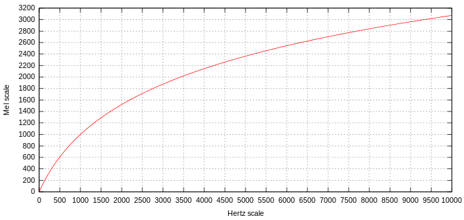

Audio/Music segmentation and clustering is an important topic that researchers have explored for years. It allows us to spot natural boundaries in the musical structure and cluster segments according to a some guideline. 

This post is based on a journal article that I read by Jonathan Foote called "Automatic Audio Segmentation Using A Measure of Audio Novelty." This is a fairly dated paper - published in 2000 - and there certainly exists more advanced techniques now. However, it seemed fairly easy to implement so I had to try it out! 

# Raw audio
I'm going to be analyzing two songs, "One More Time" by Daft Punk and "Paradise Circus" by Massive Attack. One More Time is about 5 minutes 20 seconds whereas Paradise Circus is roughly 4 minute 57 seconds. Here are the raw audio waveforms for both songs. I'm using [wavesurfer.js](http://www.wavesurfer-js.org) to visualize the audio.

### Daft Punk - One More Time

<a id="playdaft" style="cursor: pointer;" class="btn">Play/Pause</a>

One more time in typical daft punk fashion is quite mechanical and repetitive. It samples an Eddie Johns track called "More Spell on You" and also features vocals by Romanthony, which have been heavily vocoded. Instrumentally, the song consists mainly of the Eddie Johns sample, the kick drum, hats, snare, and an organ sounding instrument during the interlude. The instrumental loops run repetitively throughout the entire song with minimal modulation. The structure of the song arises mainly from variations in volume and the level of filter applied. This is not surprising since Daft Punk is categorized under "French House," which is sometimes called "Filter House" due to its heavy reliance on filtering and phaser effects.

### Massive Attack - Paradise Circus

<a id="playmassive" style="cursor: pointer;" class="btn">Play/Pause</a>

Paradise Circus is a fairly minimal track. It features the haunting vocals of Hope Sandoval, who by the way is/was? the lead singer of Mazzy Star (remember "Fade Into You?"). The melody consists mostly of the xylophone and Hope's vocals. The instrumentals sound organic and lush with drum kits, layered claps, finger snaps, and the bass dictating the rhythmic. In addition, the track is intermittently peppered with synthetic noises. Towards the of the song there is an intense crescendo of piano and strings, finally fading out with large amounts of reverberation.

# Spectrogram and mfcc

For the analysis, I first decimated (downsample) the song using a decimation factor of 8. This is done to reduce computation time (the particular files we are analyzing are not large, but I usually analyze larger files so the algorithm takes this into account). Because the original sampling frequency was 44.1 kHz the new sampling frequency is 5.5125 kHz. This means that the new Nyquist frequency - the maximum representable frequency without introducing aliasing - is 2.755 kHz. You might think that losing all that frequency information above 2.755 kHz is going to be detrimental to the analysis, but in reality the amount of decimation we've applied shouldn't affect our analysis too much. I then calculated the STFT of the signals. I used a 512 sample window size, with a 1024 sample size FFT, and 512 sample stride length. The values of the spectrogram are negative because I've transformed them to the decibel scale. The spectrograms for both songs are shown below:

#### One More Time Spectrogram

#### Paradise Circus Spectrogram

In audio analysis it's typical to go one step further and calculate the mel-frequency ceptral coefficients or mfcc. The mfcc is a transformation of the spectrogram to the mel-frequency cepstrum (mfc):

<blockquote>
In sound processing, the mel-frequency cepstrum (MFC) is a representation of the short-term power spectrum of a sound, based on a linear cosine transform of a log power spectrum on a nonlinear mel scale of frequency.
</blockquote>

The Mel scale is said to be a more accurate representation of how human auditory system respond to sound. This is the Mel scale:

Collectively, the mfc of all the frequency bands is called the mfcc.

#### One More Time MFCC

#### Paradise Circus MFCC

# Similarity matrix

We have transformed the raw audio into a spectrogram and the mfcc which both represent, in slightly different ways, how the frequencies of the sound evolve as a function of time. Now we want to establish a relation between each frame i.e., how does the amplitude of frequency x at time y relate to amplitude of frequency q at time r? One way to do this is by creating a similarity matrix. The matrix is a parameterization of how "similar" two variables are, where in our case the variables are the intensities of spectrogram/mfcc at a specific frequency and time. The measure of similarity between the variables is determined by calculating a distance metric. Common distance metrics are euclidean, cosine, and Manhattan. Here we use the correlation coefficient $$P_{ij}$$:

$$
P_{ij} = \frac{C_{ij}}{\sqrt{C_{ii}*C_{jj}}}
$$

in which $$ C_{ij} $$ is the covariance between frame i and frame j whereas $$C_{ii}$$ and $$C_{jj}$$ are just the variance of frames i and j. The matrix is formed by calculating $$P_{ij}$$ for every pair of frames in the spectrogram. Because every pair occurs twice, $$P_{ij} = P_{ji} $$, the matrix is square and symmetric. In code, this is what it looks like:


import numpy as np
from sklearn import preprocessing

def similarityMatrix(input_spectrogram):
    """ 
    Calculates the similarity matrix based on
    the Pearson correlation coefficient
    """
    scaler = preprocessing.StandardScaler()
    X = scaler.fit_transform(input_spectrogram)
    sm = np.corrcoef(X)

    return sm    

# script for plotting 
pcolormesh(frm_time, frm_time, sm, cmap='RdBu')
plt.colorbar()
plt.ylim(0, np.floor(max(frm_time)))
plt.xlim(0, np.floor(max(frm_time)))
plt.title('MFCC Similarity Matrix Paradise Circus')
plt.xlabel('time')
plt.ylabel('time')
plt.show()



We import numpy as well as use a method in scikit-learn called StandardScaler(). StandardScaler removes the mean and scales the dataset to unit variance. The code is simple since numpy does most of the heavy lifting. This is what the similarity matrices look like: 

#### One More Time Similarity Matrix

#### Paradise Circus Similarity Matrix

You'll notice the stark contrast between the two tracks. One more time has clear partitions between each section in the song, indicated by the square blocks along the diagonal of the similarity matrix. These blocks are locations of high similarity, where a value of 1.0 is maximally similar. Furthermore, there are varying sizes of square blocks, which suggest that there is local structure as well as long range structure to the song. Paradise Circus mostly lacks the partitioning of One More Time, but you can still make out some regions of similarity. This doesn't mean that the song doesn't have any structure, but just that the structure of the song is diffuse. This creates the almost dream like quality of the song. On the other hand, One More Time is a dance song and therefore the clear delineation between each section is helpful for DJs when mixing one track to another since they know where to cue the next song. 

# Checkerboard kernel and kernel correlation

So now that we have the similarity matrix, we want to segment the song along these naturally occurring boundaries. We do this by using a sliding matched filter, where the filter will be a "checkerboard." How this method works is illustrated below. The filter is slid along the diagonal of the similarity matrix from point 1 to point 3. At a point where there is no boundary (point 1) there is no increase in what we will call the novelty. However at a boundary, characterized by a high similarity (values close to 1.0) along the diagonal and very low similarity (values close to -1.0) along the off diagonals (a checkerboard pattern), the novelty measure will be a maximum (point 2). The filter effectively searches for these checkerboard patterns in the similarity matrix and filters them out. This is obviously for an ideal case and we have to remember that the result we get is sensitive to the size of the filter, which is also a weakness of this method.  

As suggested in the paper, we can create large checkerboard kernels by simply constructing the Kronecker product of the 2x2 checkerboard kernel with a matrix of ones. 

$$
\begin{bmatrix} 
1 & -1 \\ 
-1 & 1 
\end{bmatrix}
\otimes
\begin{bmatrix} 
1 & 1 \\ 
1 & 1 
\end{bmatrix}
=
\begin{bmatrix} 
1 & 1 & -1 & -1 \\ 
1 & 1 & -1 & -1 \\ 
-1 & -1 & 1 & 1 \\ 
-1 & -1 & 1 & 1 \\ 
\end{bmatrix}
$$

Code:

def checkBoardKernel(kernel_size)
    """
    Creates a checkerboard kernel
    """
    p = np.ones((kernel_size / 2, kernel_size / 2))
    q = [[1.-1], [-1, 1]]
    cbk = np.kron(q, p) 
    return cbk
 

We can also multiply the kernel with a Gaussian to taper the edges of the kernel. This is to minimize edge effects. The Gaussian function:

$$
f(x, y) = \frac{1}{2\pi \sigma} e^{-[(x-\mu_{x})^{2}+(y-\mu_{y})^{2}]/(2\sigma^{2})}
$$


def gaussianKernel(size, kernel_size_y=None):
    """
    Creates a Gaussian kernel 
    """
    size = int(size)
    if not kernel_size_y: 
        kernel_size_y = size
    else:
        kernel_size_y = int(kernel_size_y)
    x, y = np.mgrid[-size/2:size/2, -kernel_size_y/2:kernel_size_y/2]
    g = 0.5 * np.exp(-(x ** 2 / (0.5 * size/2 * float(size/2)) + 
                       y ** 2 / (0.5 * kernel_size_y/2 *  \
                                 float(kernel_size_y/2))))
    return g


We can generate the Gaussian checkerboard kernel by taking the Haddamard of the Gaussian and checkerboard kernels.
 
def gaussianCheckerBoardKernel(kernel_size):
    """
    Creates a gaussian tapered checkerboard
    kernel
    """
    gaussian_kernel = gaussianKernel(kernel_size)
    checker_board = checkBoardKernel(kernel_size)
    # Haddamard product 
    gcbk = gaussian_kernel * checker_board
    return gcbk
 

# Calculating the novelty and visualization

Now, calculating the novelty is as simple as correlating the kernel with the similarity matrix, which is summarized in the following equation:

$$
N(i) = \sum_{m = -L/2}^{L/2} \sum_{n = -L/2}^{L/2} C(m,n)S(i+m, i+n)
$$

The code to do this is: 
 
def kernelCorrelation(similarity_matrix, kernel):
    """
    Determines the kernel correlation across the diagonal of
    a similarity matrix and returns the novelty score.
    """
    K = len(kernel)
    S = len(similarity_matrix)
    iteration = S - K 
    novelty = []
    i = 1
    while i < K : 
        novelty_score = np.sum(kernel * similarity_matrix[i:i+K, i:i+K])
        novelty.append(novelty_score)
        i += 1  
    i = 1
    while iteration > 0:
        novelty_score = np.sum(kernel * similarity_matrix[i:i+K, i:i+K])
        novelty.append(novelty_score)
        i += 1
        iteration -= 1
    return novelty 

# calculate thee similarity matrix using the mfcc
sm = similarityMatrix(a.mfcc)

# construct the gaussian checkerboard kernel
r = gaussianCheckerBoardKernel(64)

# calculate the novelty
novelty = kernelCorrelation(sm, r)

# convert the number of frames in x-axis to time in seconds 
num_frames = int(a._mag_stft[:,0].size)
frm_time = 512 * np.arange(num_frames) / float(a._sample_rate)

# script for plotting
# prewritten script for plotting input sound waveform
a.plotInputSound()

# plot the the normalized novelty
plt.plot(frm_time[1:], normalize1D(novelty), color='red', label="novelty")
plt.legend()
plt.show()
 

The code takes into account of the fact that the kernel does not perfectly overlap the similarity matrix when we first begin sliding the kernel over the matrix. Below are the calculated novelty scores plotted over the raw audio waveforms:

#### One More Time Novelty 

#### Paradise Circus Novelty 

Having calculated the novelties, we have to segment the songs along areas of high novelty. For this we first have to locate the peaks in the novelty. You'll notice though, that there are a lot of peaks. This is the another weakness of this techniques, which is that you have to choose a cutoff threshold for the novelty when choosing where to segment the song along points of high novelty. Just looking at the peaks and the structure of the songs, 0.5 seems to be a reasonable threshold for the normalized novelty.

To draw the segments using wavesurfer.regions we have to create a json file with the start and finish times of each segment. We therefore have to determine the locations of the peaks with the condition that the normalized novelty measure doesn't exceed 0.5. We do this with the following code: 
 
# normalize the novelty to maximum of 1
normalize1D(novelty)

# the peak detector didn't work well with values < 1
# so i had to multiply the everything by 100
# therefore 100 is equivalent to 1 for our normalized novelty 
n = np.dot(n, 100)

# find the peaks! 
p = peakdet(n, 1)[0]

# list comprehension to conditionally 
# filter the peaks for peaks with values < 50
# p[0] is the index value of the peak
# p[1] is the value of the peak, but we don't need that
p = [p[0] for p in p if p[1] > 50]

 

We then have to calculate the start and end times for each segment. This is done mostly through list manipulation as well as using pandas to save the json file: 
 
import pandas as pd

# p contains the indices for each peak, hence
# we have to plug the indices into frm_time
# to get back the time in seconds for each peak.
times = []
for index in p:
    times.append(frm_time[index])

# Inserting time = 0 seconds because the start time for the
# first segment is 0 seconds
times.insert(0, 0)

# create the pandas dataframe with just the start values
df1 = pd.DataFrame(data=times, columns=['start'])

# also create a list called end
# we offset the end time by 0.1 so that
# it doesn't overlap with the next starting segment
end = [time - 0.1 for time in times]

# pop the first element in the end list since we don't need it!
end.pop(0)

# also append the ending time for the last segment
end.append(frm_time[len(frm_time) - 1])

# create new column called end in df1
# and assign end list values
df1['end'] = end

# write to the json file!
df1.to_json('paradise.json', orient='records')

 

The rest is basically writing some javascript code to read the json file and loading the regions into wavesurfer. My javascript skills aren't great, but I was able to do it after some struggling. Here are the results! How well does the algorithm perform?

### Daft Punk - One More Time

<a id="playdaft2" style="cursor: pointer;" class="btn">Play/Pause</a>

### Massive Attack - Paradise Circus

<a id="playmassive2" style="cursor: pointer;" class="btn">Play/Pause</a>

It's definitely not perfect, but it's not horrible either. In One More Time, the filter seems to be segmenting along large changes in volume and is moderately successful in picking up variations in harmonic progression. The filter probably does a decent job segmenting along harmonic progressions since the song is so repetitive and has a very solid harmonic structure. I'm surprised that it didn't pick up the "drop" at 4:18, but that is likely due to the size of the filter. On the other hand, in Paradise Circus the filter seems to mostly be segmenting along vocal utterances. This is probably because the song is so minimal and that the vocalist occupies a large portion of the overall mix, so the filter has an easier time picking up the subtle changes in utterance. Towards the end, the filter also picks up changes in instrumentation, from piano to strings.

# Conclusion
So we saw that the filter does an okay job. Yes, the filter isn't made to extract "significance" from each section of the song. It definitely doesn't understand the words, thus it doesn't actually understand verse-chorus form. It also doesn't really understand what melody or harmony is, it's just calculating correlations between audio frames. But in the end, it seems like a more sophisticated method of segmentation over volume segmentation or rhythm. Performance wise, it's fairly quick and the beauty is that it doesn't require a prior training step or a labeled dataset. There are definitely flaws, thresholding and filter size are two obvious ones. In any case, you can further organize the segments with clustering, which the authors do in a subsequent paper, adding sophistication to the model.
